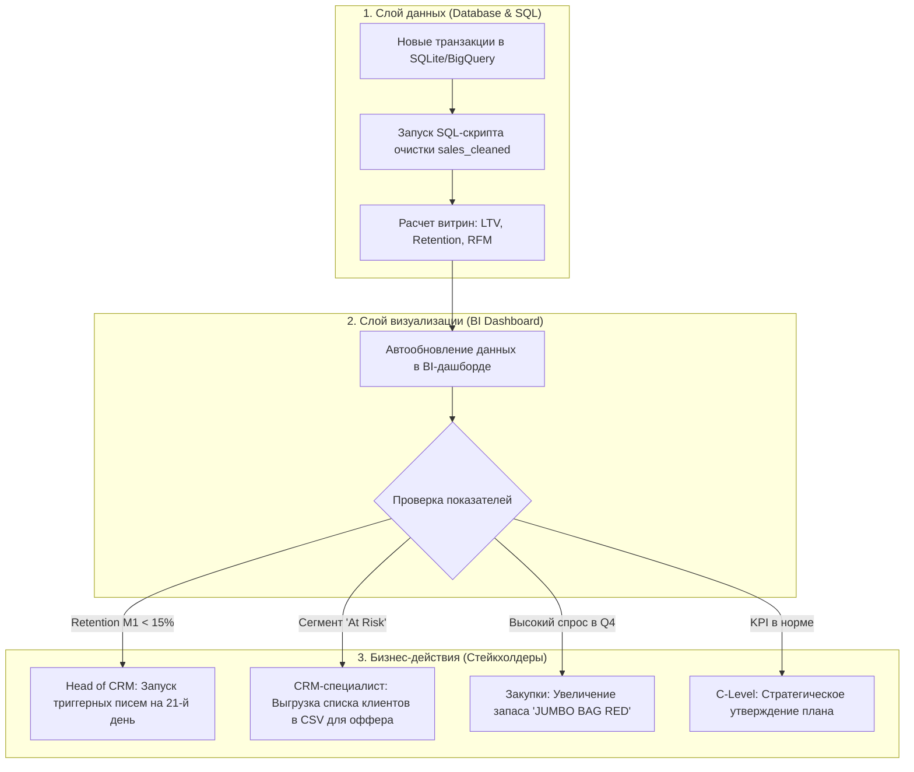

## 📝 Пользовательские истории и критерии приемки 

### US-1: Оперативный контроль KPI (для C-Level)
* **User Story:** Как CEO, я хочу видеть ключевые показатели бизнеса на одном экране, чтобы за 10 секунд оценить состояние продаж без запросов к аналитикам.
* **Acceptance Criteria (AC):**
  * **GIVEN** я открываю первую страницу дашборда («Overview»),
  * **WHEN** страница загружается,
  * **THEN** в верхней части отображаются 4 KPI-карточки: Revenue ($), Orders Count, AOV ($), Active Customers.
  * **AND** под каждой метрикой выводится % динамики к прошлому месяцу (MoM %).

---

### US-2: Анализ удержания по когортам (для Head of CRM)
* **User Story:** Как CRM-менеджер, я хочу видеть матрицу Retention Rate по когортам, чтобы отслеживать отток клиентов в первые 3 месяца (M1–M3).
* **Acceptance Criteria (AC):**
  * **GIVEN** я перехожу на вкладку «Cohorts & LTV»,
  * **WHEN** я выбираю временной период,
  * **THEN** отображается тепловая карта (Heatmap) удержания по месяцам (M0–M12).
  * **AND** ячейки с Retention < 15% автоматически подсвечиваются красным цветом.

---

### US-3: Выгрузка сегментов для CRM-кампаний (для CRM-специалиста)
* **User Story:** Как CRM-специалист, я хочу кликнуть на сегмент «At Risk» в RFM-матрице, чтобы получить список клиентов для реанимационной рассылки.
* **Acceptance Criteria (AC):**
  * **GIVEN** я нахожусь на странице «RFM Segmentation»,
  * **WHEN** я кликаю на блок «At Risk» (Recency > 90 дней, высокий чек),
  * **THEN** таблица ниже фильтруется по `CustomerID` с датой последней покупки и доступна кнопка экспорта в CSV/Excel.

---

### US-4: Планирование товарных запасов (для Закупок)
* **User Story:** Как менеджер по закупкам, я хочу видеть топ-10 продаваемых товаров за период, чтобы заблаговременно формировать заказы поставщикам перед Q4.
* **Acceptance Criteria (AC):**
  * **GIVEN** я выбираю фильтр периода,
  * **WHEN** я отсортировываю гистограмму по объему продаж,
  * **THEN** система выводит топ-10 товаров с указанием названия (`Description`), суммы ($) и проданного количества (`Quantity`).
 
## 🔄 BPMN-диаграмма бизнес-процесса (TO-BE)

Ниже представлена схема целевого бизнес-процесса (TO-BE) регулярной работы с BI-системой и CRM-автоматизацией.

## Описание дорожек (Swimlanes) и ролей

### Data Layer (Автоматика/SQL)
Система агрегирует сырые продажи, отсекает возвраты и обновляет расчитанные витрины (`cleaned_sales_view`, `rfm_summary`, `ltv_cohorts`).

### BI Layer (Дашборд)
Данные визуализируются на 3 экранах с настроенной подсветкой пороговых значений (Alerts).

### Business Actions (Стейкхолдеры)
На основе отклонений менеджеры совершают точечные действия:

- **CRM:** отправка промокодов сегменту «At Risk».
- **Закупки:** докупка ходовых позиций до наступления дефицита.

