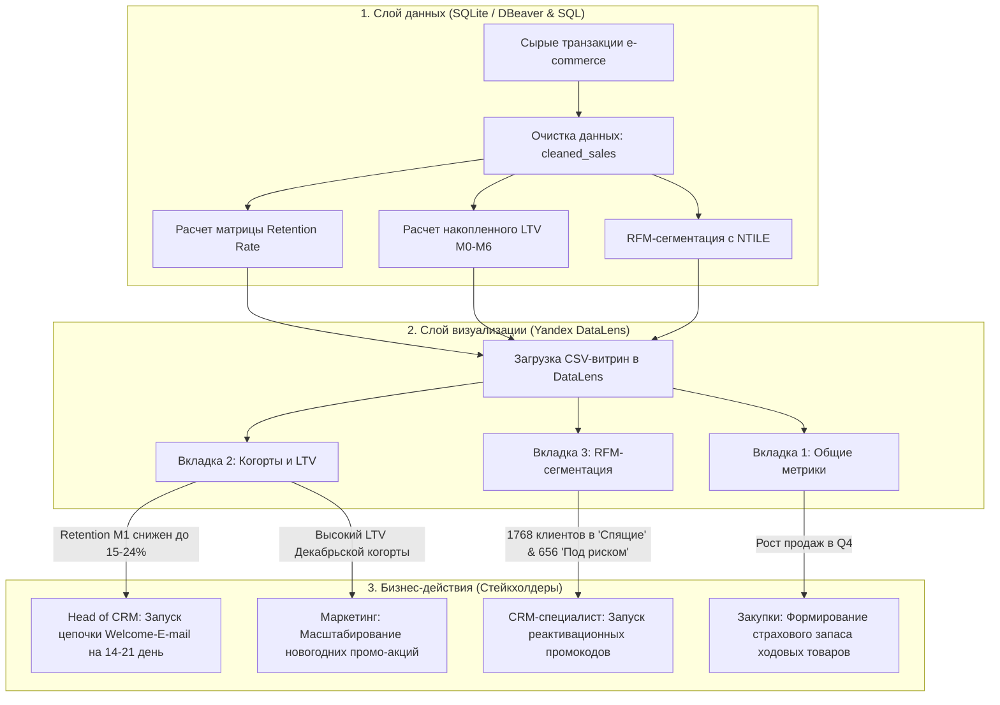

#  Документ бизнес-требований (Business Requirements Document — BRD)
## Проект: Аналитическая BI-система и сквозной дашборд «E-Commerce Executive Overview»

---

### Паспорт документа (Document Control)

| Параметр | Значение |
| :--- | :--- |
| **Название проекта** | Внедрение BI-системы e-commerce аналитики (`E-Commerce Executive Overview`) |
| **Версия документа** | `v2.0 (Final Release)` |
| **Дата обновления** | `24 августа 2026 г.` |
| **Целевая платформа BI** | Yandex DataLens |
| **СУБД / Источник данных** | SQLite / DBeaver (`cleaned_sales`) |
| **Целевая аудитория** | C-Level (CEO/COO), Head of CRM, CRM-аналитики, Менеджеры по закупкам |

---

## 1. Обзор проекта и бизнес-цели (Executive Summary)

### 1.1. Контекст и проблематика
В текущей модели управления e-commerce бизнесом отсутствует единая система оперативного мониторинга ключевых показателей (KPI), анализа окупаемости клиентов и сегментации активной базы. Анализ данных проводился разрозненно через выгрузки из транзакционных систем, что затрудняло:
* Своевременный контроль оттока клиентов в первые месяцы после совершения первой покупки;
* Оценку реальной накопленной ценности клиентов (LTV) по сезонным когортам;
* Проведение персональных маркетинговых и реактивационных CRM-кампаний.

### 1.2. Цель проекта
Разработать и внедрить интерактивный 3-страничный BI-дашборд в **Yandex DataLens** на базе очищенной SQL-витрины транзакций, позволяющий руководству за 10 секунд оценивать состояние бизнеса, а CRM- и коммерческому отделам — принимать точечные дата-центричные решения.

### 1.3. Ключевые бизнес-метрики проекта (KPIs)
1. **Retention Rate ($M_1$)** — удержание клиентов на 1-й месяц после первой покупки.
2. **Накопленный LTV ($M_6$)** — средняя совокупная выручка на одного клиента за 6 месяцев жизни когорты.
3. **RFM-структура базы** — соотношение клиентов по сегментам («VIP», «Лояльные», «Под риском ухода», «Спящие»).
4. **Оперативные KPI** — Выручка ($), Количество заказов, AOV ($), Активные клиенты.

---

## 2. Матрица стейкхолдеров и ролей (Stakeholders Matrix)

| Роль | Потребности в аналитике | Используемая вкладка дашборда | Ключевые действия |
| :--- | :--- | :--- | :--- |
| **C-Level (CEO / COO)** | Верхнеуровневый контроль выручки, динамики заказов и среднего чека. | `Общие метрики` | Стратегическое планирование, утверждение бюджетов. |
| **Head of CRM** | Мониторинг удержания (Retention) и оценка эффективности новогодних когорт. | `Когорты и LTV` | Изменение стратегии Onboarding / Welcome-цепочек. |
| **CRM-специалист** | Детализация базы по RFM-сегментам, поиск оттока и групп для промо-кампаний. | `RFM-сегментация` | Запуск реактивационных E-mail/SMS рассылок с промокодами. |
| **Менеджер по закупкам** | Оценка спроса по топовым товарным позициям и подготовка к пиковому сезону (Q4). | `Общие метрики` | Закупка страховых запасов ходовых товаров. |

---

## 3. Пользовательские истории и критерии приемки (User Stories & Acceptance Criteria)

### US-1: Оперативный контроль KPI бизнеса (для C-Level / Executive)
* **User Story:** Как генеральный директор / C-Level руководитель, я хочу видеть верхнеуровневые KPI и общую динамику продаж на одном экране, чтобы за несколько секунд оценить состояние бизнеса без обращения к аналитикам.
* **Acceptance Criteria (AC):**
  * **GIVEN** я открываю первую вкладку дашборда (`Общие метрики` / `Executive Overview`),
  * **WHEN** страница загружается,
  * **THEN** в верхней панели отображаются ключевые метрики: Выручка ($), Количество заказов, Средний чек (AOV, $), Активные клиенты.
  * **AND** под метриками выводится их динамика и помесячные тренды.

---

### US-2: Анализ когортного удержания и окупаемости LTV (для Head of CRM)
* **User Story:** Как CRM-директор, я хочу отслеживать матрицу Retention Rate и накопленный LTV по когортам клиентов за 6 месяцев ($M_0 \dots M_6$), чтобы выявлять узкие места в удерживании клиентов и оценивать окупаемость новогодних промо-акций.
* **Acceptance Criteria (AC):**
  * **GIVEN** я перехожу на вкладку `Когорты и LTV`,
  * **WHEN** отображаются виджеты `ch_retention_matrix` и `ch_cohort_ltv`,
  * **THEN** я вижу тепловую карту Retention Rate (%) с подсвеченным провалом активности на 1-й месяц ($M_1$),
  * **AND** таблицу с накопленным LTV ($), показывающую рост ценности когорты к 6-му месяцу ($M_6$).
  * **AND** справа выводится текстовый блок с ключевыми выводами (Executive Summary).

---

### US-3: Сегментация клиентской базы по RFM (для CRM-специалиста)
* **User Story:** Как CRM-специалист, я хочу видеть распределение клиентской базы по RFM-сегментам и их ключевые параметры (Recency, Frequency, Monetary), чтобы планировать таргетированные рассылки.
* **Acceptance Criteria (AC):**
  * **GIVEN** я нахожусь на вкладке `RFM-сегментация`,
  * **WHEN** загружается страница,
  * **THEN** круговая диаграмма показывает процентное и количественное соотношение 4-х сегментов (VIP, Лояльные, Под риском ухода, Спящие/Потерянные),
  * **AND** сводная таблица выводит среднюю давность покупки (`avg_recency_days`), частоту заказов (`avg_orders_per_customer`) и среднюю выручку (`avg_revenue_per_customer`) по каждому сегменту.

---

### US-4: Анализ товарных запасов и спроса (для Закупок / Supply Chain)
* **User Story:** Как менеджер по закупкам, я хочу знать топ-продаваемые товары и их сезонную динамику, чтобы оптимизировать складские запасы перед пиковыми периодами продаж (Q4).
* **Acceptance Criteria (AC):**
  * **GIVEN** я нахожусь на вкладке общих метрик,
  * **WHEN** я анализирую рейтинги продаж,
  * **THEN** система выводит топ-позиции по объему выручки ($) и проданным единицам (`Quantity`).

---

## 4. BPMN-диаграмма целевого бизнес-процесса (TO-BE)

Схема взаимодействия слоя обработки данных, BI-визуализации в Yandex DataLens и принятия бизнес-решений:

---

## 5. Описание дорожек (Swimlanes) и ролей

### 1. Data Layer (Инженерия данных / SQL)
Автоматизированный процесс подготовки данных в SQLite с помощью DBeaver:
* Исключение возвратов, дублей и аномальных строк (`cleaned_sales`).
* Расчет матрицы удержания клиентов по когортам ($M_0 \dots M_6$).
* Агрегация накопленного LTV на одного клиента.
* Расчет показателей Recency, Frequency, Monetary и распределение клиентов по 4 бизнес-сегментам с помощью функции `NTILE(4)`.

### 2. BI Layer (Аналитика / Yandex DataLens)
Интерактивный дашборд `E-Commerce Executive Overview` из 3-х целевых экранов:
* Вкладка 1: **`Общие метрики`** — верхнеуровневый бизнес-обзор.
* Вкладка 2: **`Когорты и LTV`** — матрица удержания и LTV с текстовым блоком выводов.
* Вкладка 3: **`RFM-сегментация`** — структурирование базы по поведению.

### 3. Business Actions (Принятие решений стейкхолдерами)
Конкретные операционные и стратегические шаги на основе аналитики:
* **CRM-отдел:** Разработка триггерных писем для устранения оттока на 2-й и 3-й неделях ($M_1$ Retention проваливается до 15–24%). Реактивация 2 424 клиентов из зон риска и спачки.
* **Маркетинг:** Рост бюджетов на предновогоднее привлечение на основе LTV декабрьских когорт ($3 469.27).
* **Закупки:** Подготовка товарного запаса популярных товаров перед наступлением высокого сезона Q4.

---

## 6. Бизнес-правила и расчетные формулы (Business Rules)

1. **Очистка данных:** Исключаются транзакции с отрицательными или нулевыми значениями `Quantity` и `UnitPrice`, а также строки без `CustomerID`.

2. **Когорта пользователя (`cohort_month`):** Месяц первой покупки клиента (`MIN(DATE(InvoiceDate))`).

3. **Retention Rate (Mₓ):**
   Retention Rateₓ = (Количество активных клиентов в месяц X) / (Размер исходной когорты M₀) × 100%

4. **Накопленный LTV (Mₓ):**
   LTVₓ = (Сумма выручки когорты за месяцы 0…X) / (Размер исходной когорты M₀)

5. **Логика RFM-сегментации:**
   - **VIP / Топ-клиенты**: R = 4, F ≥ 3, M ≥ 3 (высокая частота, недавний визит, максимальный чек)
   - **Лояльные / Перспективные**: R ≥ 3, F ≥ 2
   - **Под риском ухода**: R ≤ 2, F ≥ 3 (активные в прошлом, но давно не покупавшие)
   - **Спящие / Потерянные**: Все остальные клиенты
