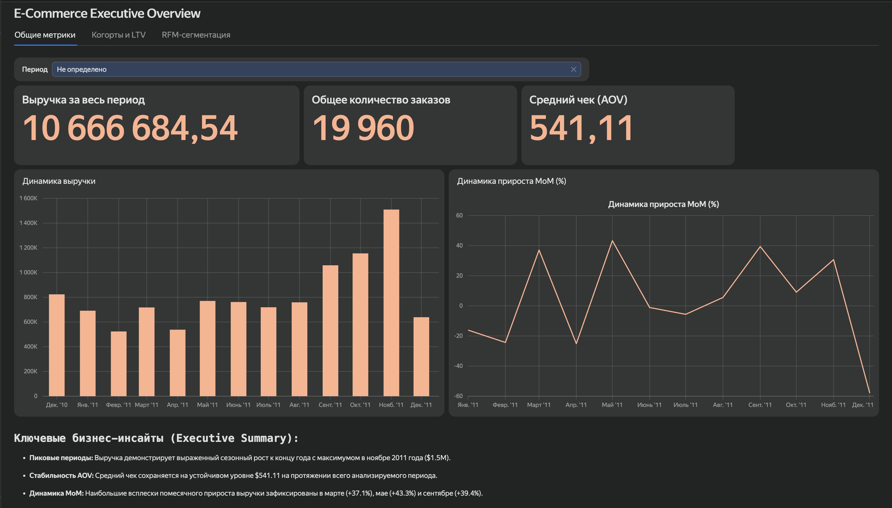
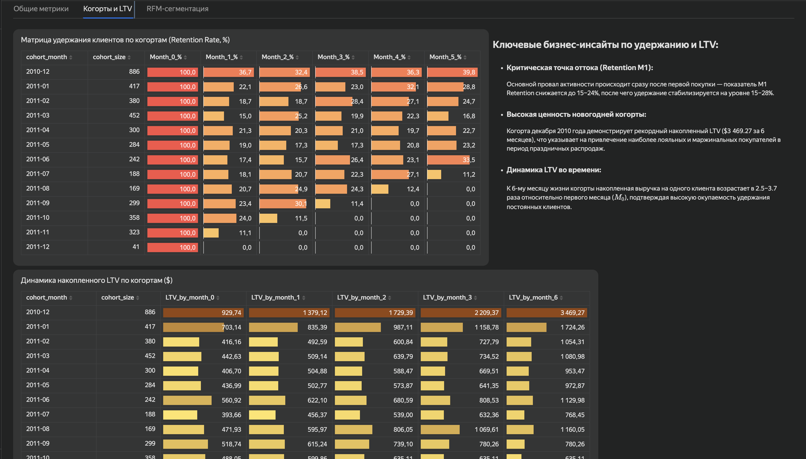
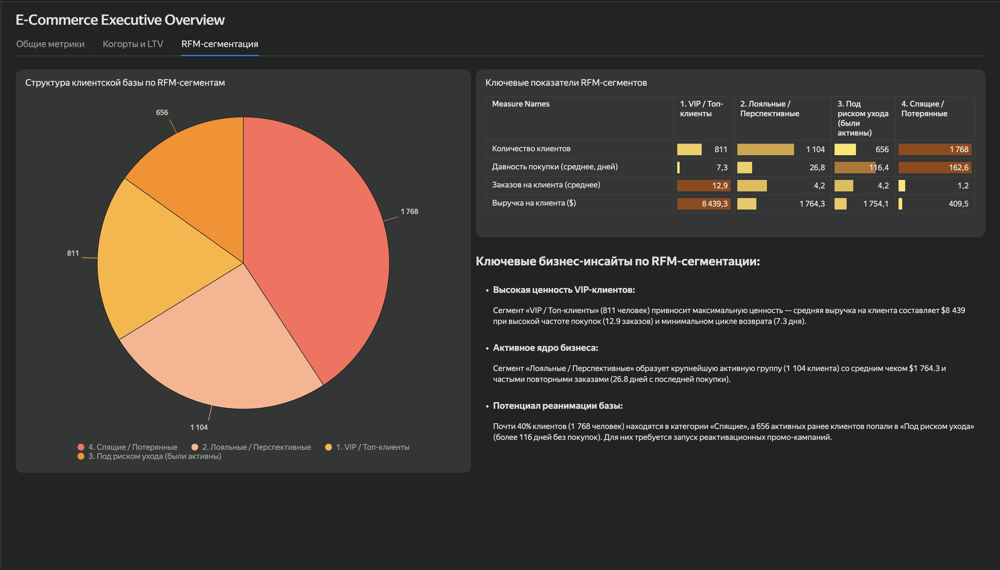

# Сквозная BI-система продаж и удержания клиентов для E-Commerce 
## (E-Commerce Executive Overview & CRM Analytics: End-to-End BI Solution)

[](https://datalens.yandex.ru/)
[](https://www.sqlite.org/)
[](https://www.sqlite.org/)
[](./BRD.md)

---

## 🌐 Language / Язык
- [🇬🇧 English Version](#-english-version)
- [🇷🇺 Русская версия](#-русская-версия)

---

<a name="english-version"></a>
## 🇬🇧 English Version

### 🔗 Live Interactive Dashboard & SQL Source Code
- 📊 **[Open Interactive Dashboard in Yandex DataLens](https://datalens.yandex/84jzmp8ptdiqr)** 
- 🗄️ **SQL Data Marts Scripts:**
  - [`01_data_cleaning.sql`](./sql/01_data_cleaning.sql) — Transactions filtering & data hygiene.
  - [`02_cohort_retention.sql`](./sql/02_cohort_retention.sql) — Monthly cohort retention matrix ($M_0 \dots M_6$).
  - [`03_cohort_ltv.sql`](./sql/03_cohort_ltv.sql) — Cumulative LTV estimation per cohort.
  - [`04_rfm_segmentation.sql`](./sql/04_rfm_segmentation.sql) — RFM calculations using `NTILE(4)` and segment mapping.

---

### 🖼️ Dashboard Preview & Key Screenshots

#### Tab 1: Executive Overview


#### Tab 2: Cohort Analysis & LTV


#### Tab 3: RFM Customer Segmentation


---

### 📌 Project Overview
This project presents an end-to-end Business Intelligence (BI) solution for an international e-commerce business. Built on a clean SQL data pipeline (**SQLite / DBeaver**) and rendered in **Yandex DataLens**, the dashboard transforms raw transaction logs into actionable insights for **C-Level Executives**, **CRM Strategists**, and **Supply Chain Managers**.

---

### 🎯 Business Context & Problem Statement
Prior to this solution, decision-makers relied on manual spreadsheet exports. This caused significant operational bottlenecks:

| Problem | Business Impact |
|:---|:---|
| **Lack of real-time sales visibility** | C-Level executives struggled to monitor Revenue, AOV, and MoM trends instantly. |
| **High customer churn post-purchase** | CRM team couldn't identify retention drop-offs (**M1 Retention dipping to 15–24%**). |
| **Unsegmented customer base** | Marketing spent budget on blanket campaigns instead of targeted RFM offers. |
| **Inventory risk before peak season** | Supply chain lacked category-level demand forecasts for Q4 sales surges. |

---

### 🛠️ Tech Stack & Architecture

```
[Raw E-Commerce Transactions] 
            │
            ▼
[SQLite DB via DBeaver] ──► Data Cleaning (`cleaned_sales`)
            │
            ├─► CTE & Window Functions (NTILE, SUM OVER)
            │
            ▼
[SQL Data Marts / CSV] ──► Revenue, Cohort Retention, LTV, RFM
            │
            ▼
[Yandex DataLens Dashboard]
            ├─► Tab 1: 📊 Executive Overview (KPIs, Trends, Products)
            ├─► Tab 2: 📊 Cohorts & LTV (Retention Heatmap, Cumulative LTV)
            └─► Tab 3: 🎯 RFM Segmentation (VIP, Loyal, At Risk, Dormant)
```

| Layer | Technology / Tools |
|:---|:---|
| **Data Warehouse / DB** | SQLite / DBeaver |
| **Data Transformation** | SQL (Common Table Expressions, Window Functions `NTILE`, `ROW_NUMBER()`, `SUM() OVER`) |
| **BI & Visualization** | **Yandex DataLens** (3 interactive dashboard tabs) |
| **Process Modeling** | BPMN (Mermaid.js) |
| **Documentation** | Markdown (`BRD.md`, `README.md`) |

---

### 📊 Key Results & Business Impact

| Metric / Area | Before Project | After Project | Business Value |
|:---|:---|:---|:---|
| **Reporting Speed** | 4+ hours (manual) | Real-time / Instant | **100% automated analytics** |
| **M1 Retention** | Unmonitored (15–24%) | Tracked via Cohort Matrix | Targeted welcome e-mail flows launched |
| **CRM Targeting** | Mass emails | 4 distinct RFM segments | Reactivation for **2,424 At-Risk/Dormant users** |
| **Holiday LTV Peak** | Unknown ROI | December Cohort LTV ($3,469.27) | Scaled holiday marketing budgets |

---

### 📄 Project Documentation
- **[📘 Business Requirements Document (BRD.md)](./BRD.md)** — Complete specifications, User Stories (GIVEN-WHEN-THEN), BPMN process flows, Stakeholder matrix, and business formulas.

---

<a name="русская-версия"></a>
## 🇷🇺 Русская версия

### 🔗 Интерактивный дашборд и SQL-скрипты
- 📊 **[Открыть интерактивный дашборд в Yandex DataLens](https://datalens.yandex/84jzmp8ptdiqr)** 
- 🗄️ **SQL-скрипты витрин данных:**
  - [`01_data_cleaning.sql`](./sql/01_data_cleaning.sql) — Фильтрация транзакций и обработка аномалий.
  - [`02_cohort_retention.sql`](./sql/02_cohort_retention.sql) — Расчет помесячной матрицы удержания ($M_0 \dots M_6$).
  - [`03_cohort_ltv.sql`](./sql/03_cohort_ltv.sql) — Расчет накопленной ценности клиентов (LTV).
  - [`04_rfm_segmentation.sql`](./sql/04_rfm_segmentation.sql) — RFM-анализ с помощью `NTILE(4)` и категоризация.

---

### 🖼️ Обзор экранов дашборда

#### Вкладка 1: Общие метрики (Executive Overview)


#### Вкладка 2: Когорты и LTV


#### Вкладка 3: RFM-сегментация клиентов


---

### 📌 Описание проекта
Проект представляет собой разработку сквозной BI-системы для e-commerce компании. На основе очищенного SQL-хранилища (**SQLite / DBeaver**) и BI-платформы **Yandex DataLens** создан интерактивный дашборд из 3-х экранов, трансформирующий транзакционные данные в готовые бизнес-решения для **C-Level**, **Head of CRM** и **отдела закупок**.

---

### 🎯 Текущая ситуация и проблема
До внедрения BI-системы аналитика собиралась вручную через Excel-файлы. Это создавало системные сложности:

| Проблема | Влияние на бизнес |
|:---|:---|
| **Отсутствие оперативного контроля** | Руководство не видело текущую динамику выручки, заказов и среднего чека (AOV). |
| **Провал удержания после 1-й покупки** | CRM-отдел пропускал отток клиентов (**Retention M1 проваливался до 15–24%**). |
| **Отсутствие сегментации базы** | Маркетинг запускал массовые рассылки вместо персонализированных офферов. |
| **Риски дефицита товаров на складе** | Закупки не могли точно оценить спрос на популярные категории перед пиковым сезоном Q4. |

---

### 🛠️ Технологический стек и архитектура

| Уровень | Технологии |
|:---|:---|
| **Хранилище данных** | SQLite / DBeaver |
| **Обработка данных (SQL)** | SQL (CTE, оконные функции `NTILE`, `ROW_NUMBER()`, `SUM() OVER`) |
| **Визуализация (BI)** | **Yandex DataLens** (3 интерактивные вкладки) |
| **Моделирование процессов** | BPMN (Mermaid.js) |
| **Документация** | Markdown (`BRD.md`, `README.md`) |

---

### 📊 Бизнес-результаты и эффект

| Метрика / Направление | До проекта | После проекта | Эффект для бизнеса |
|:---|:---|:---|:---|
| **Скорость подготовки отчетов** | 4+ часа (вручную) | Мгновенно | **100% автоматизация отчетности** |
| **Контроль оттока (Retention M1)** | Без отслеживания (15–24%) | Наглядная матрица когорт | Запуск Welcome-цепочек на 14–21 дни |
| **Сегментация CRM** | Массовые рассылки | 4 RFM-сегмента | Реактивация **2 424 клиентов** (Риск + Спящие) |
| **Планирование пика Q4** | Неточные гипотезы | Расчет LTV когорт ($3 469.27) | Масштабирование новогодних промо-бюджетов |

---

### 📄 Документация проекта
- **[📘 Business Requirements Document (BRD.md)](./BRD.md)** — Полный документ бизнес-требований: пользовательские истории (User Stories / AC), BPMN-диаграмма процессов, матрица стейкхолдеров и расчетные формулы.
